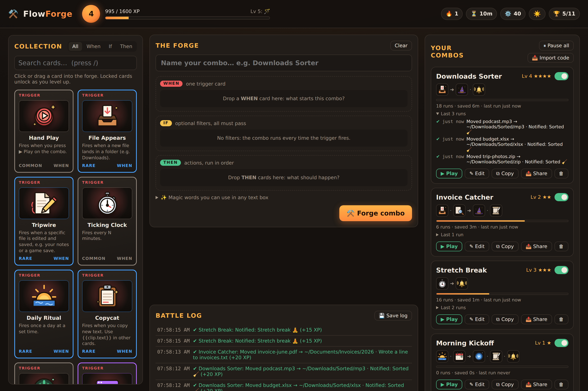
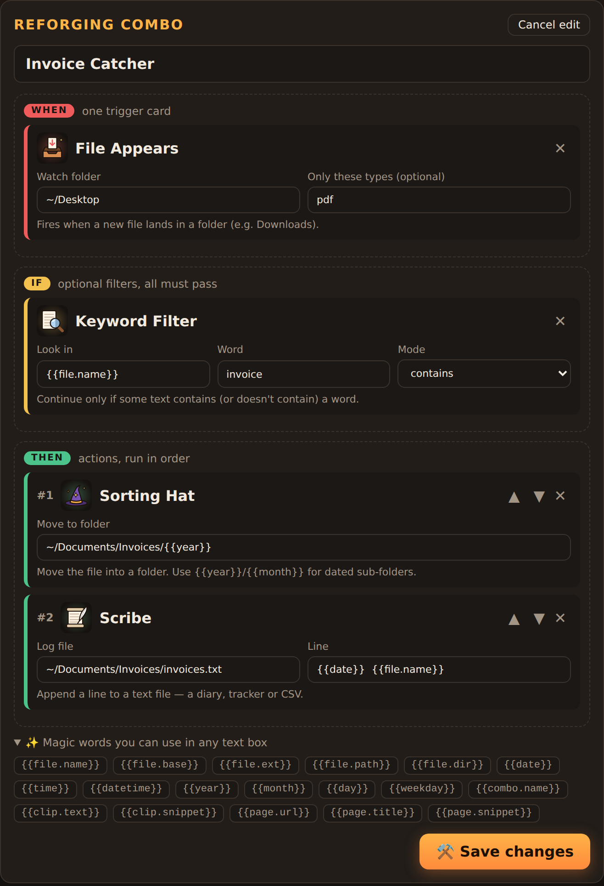
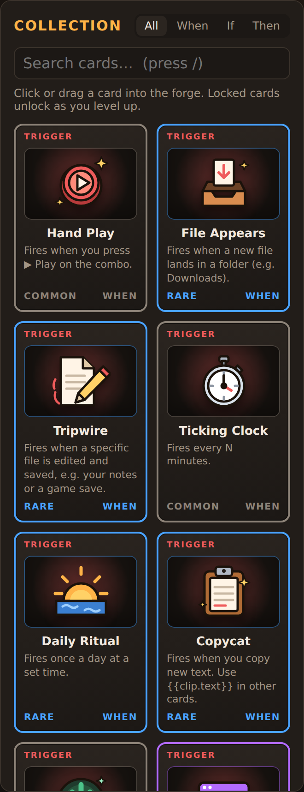
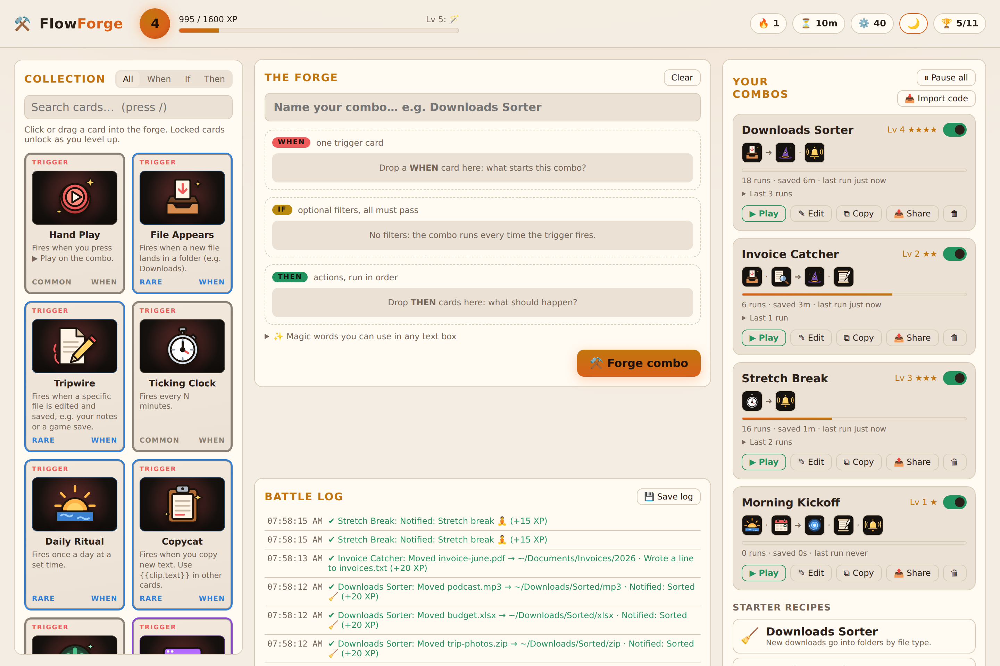
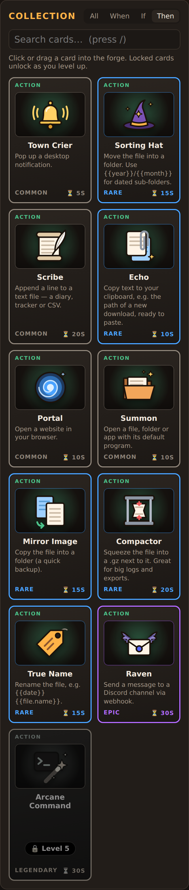
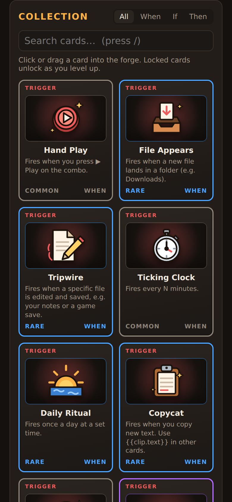
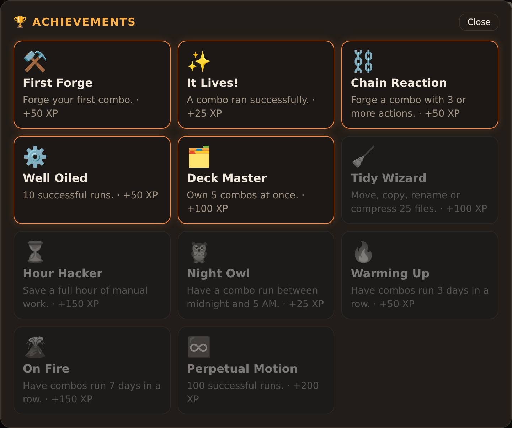

# ⚒️ FlowForge

[](https://github.com/Necromancervbh/Flowforge-/actions/workflows/test.yml)

**A deckbuilder where every card is a real automation on your PC.**

Snap cards together into combos: a **WHEN** card (trigger), optional **IF** cards (filters) and **THEN** cards (actions). Every combo actually runs on your computer, sorting downloads, reminding you to take breaks, logging files, pinging Discord. Each successful run earns XP, levels up the combo and your player level, and unlocks rarer cards.

```
 📥 File Appears  →  🔎 Keyword "invoice"  →  🎩 Sorting Hat  ·  📜 Scribe
   (in Downloads)       (in the file name)     (to Invoices/2026)  (log it)
```



## Screenshots

| The Forge: snap cards into a combo | Collection: cards unlock as you level up |
|---|---|
|  |  |

| Light theme | Action cards: common → rare → epic → legendary |
|---|---|
|  |  |

| On a phone | Achievements |
|---|---|
|  |  |

Every card has its own hand-drawn SVG illustration (`public/art.js`), so there are no image files to download and the art stays sharp at any size. Epic cards glow and legendary cards shimmer.

## Run it

Needs [Node.js](https://nodejs.org) 20 or newer. There are no other dependencies.

```bash
git clone https://github.com/necromancervbh/flowforge-.git
cd flowforge-
npm start
```

Your browser opens at <http://localhost:4777>. Keep the terminal open: that's the engine running your combos. Progress is saved in `~/.flowforge/save.json`.

Options (after `npm start --`, e.g. `npm start -- --port 4778`):

| Option | What it does |
|---|---|
| `-p, --port <n>` | Use another port (default 4777; also `$PORT`) |
| `-d, --data <dir>` | Keep the save somewhere else (default `~/.flowforge`; also `$FLOWFORGE_DATA`) |
| `--no-open` | Don't open the browser on start |
| `-v, --version` / `-h, --help` | Print the version / the help |

New here? Click a **starter recipe** (Downloads Sorter, Invoice Catcher, Screenshot Stash, Stretch Break, Link Collector) to load a ready-made combo into the forge. Recipes that use cards you haven't unlocked yet show 🔒 and the level they need.

**Test a file combo:** press **▶ Play** on a combo that starts with *File Appears* and paste the path of a file to try it on. The combo really runs, so that file may be moved or renamed.

**Find cards fast:** press `/` to search the collection by name, description, rarity or type (`then rare` shows rare action cards). `Esc` clears the search.

**What did it do?** Each combo shows its **last 5 runs** (done, held back or failed) with the time and what happened.

**Light or dark:** the ☀️ / 🌙 button in the header switches themes, and FlowForge remembers your choice.

**Keep a record:** **💾 Save log** downloads the Battle Log as a text file (oldest entry first).

**Take a break:** **⏸ Pause all** stops every combo at once (handy while presenting or gaming), and **▶ Resume all** turns them back on.

**Make variations:** **⧉ Copy** opens a duplicate of a combo in the forge as *"Name (copy)"*, so you can tweak it without rebuilding.

**Share combos with friends:** press **📤 Share** on a combo to copy a code like `FF1-eyJu…`, and your friend pastes it with **📥 Import code**. Secret settings such as Discord webhook URLs are left out of the code.

## Cards

| | Card | Rarity | Unlocks | What it does |
|---|---|---|---|---|
| **WHEN** | 🖐️ Hand Play | common | Lv 1 | Fires when you press ▶ Play |
| | 📥 File Appears | rare | Lv 1 | A new file lands in a folder (optionally only certain types) |
| | ⏱️ Ticking Clock | common | Lv 1 | Every N minutes |
| | 🌅 Daily Ritual | rare | Lv 2 | Once a day at a set time |
| | 📋 Copycat | rare | Lv 2 | You copy new text (e.g. collect every link you copy) |
| | ✏️ Tripwire | rare | Lv 3 | A specific file is edited and saved (notes, a game save…) |
| | 🔌 Power On | common | Lv 3 | When FlowForge starts |
| | 🔭 Web Watcher | epic | Lv 4 | A web page's text changes |
| **IF** | 🔎 Keyword Filter | common | Lv 1 | Text contains / doesn't contain a word |
| | 🧩 Type Gate | common | Lv 1 | Only certain file types (or everything except them) |
| | 🕘 Office Hours | common | Lv 2 | Only between two times |
| | 📅 Calendar Gate | common | Lv 2 | Only weekdays / weekends |
| | ⚖️ Heavy Load | rare | Lv 3 | File bigger / smaller than N MB |
| **THEN** | 🔔 Town Crier | common | Lv 1 | Desktop notification |
| | 🎩 Sorting Hat | rare | Lv 1 | Move the file to a folder |
| | 📜 Scribe | common | Lv 1 | Append a line to a text file |
| | 📎 Echo | rare | Lv 2 | Copy text to the clipboard (e.g. a new download's path) |
| | 🌀 Portal | common | Lv 2 | Open a website |
| | 📂 Summon | common | Lv 2 | Open a file, folder or app |
| | 🪞 Mirror Image | rare | Lv 3 | Copy the file to a folder |
| | 🏷️ True Name | rare | Lv 3 | Rename the file |
| | 🗜️ Compactor | rare | Lv 3 | Compress the file to `.gz` (keep or delete the original) |
| | 🐦‍⬛ Raven | epic | Lv 4 | Post to a Discord webhook |
| | 🪄 Arcane Command | legendary | Lv 5 | Run a shell command |

### Magic words

Any text box can use placeholders that are filled in when the combo runs:
`{{file.name}}`, `{{file.base}}`, `{{file.ext}}`, `{{file.path}}`, `{{file.dir}}`, `{{date}}`, `{{time}}`, `{{datetime}}`, `{{year}}`, `{{month}}`, `{{day}}`, `{{weekday}}`, `{{combo.name}}`, `{{clip.text}}`, `{{clip.snippet}}`, `{{page.url}}`, `{{page.title}}`, `{{page.snippet}}`.

Example: move to `~/Documents/Sorted/{{year}}/{{file.ext}}`.

Another example, a **Link Collector** that saves every link you copy:

```
📋 Copycat  →  🔎 Keyword "http" in {{clip.text}}  →  📜 Scribe "{{datetime}} {{clip.text}}" to ~/Documents/links.txt
```

On Linux, Copycat needs `wl-clipboard` (Wayland) or `xclip` / `xsel` (X11). macOS and Windows work out of the box.

The **Arcane Command** card is the exception: it gets these as environment variables (`$FF_FILE_PATH`, `$FF_FILE_NAME`, `$FF_FILE_EXT`, `$FF_COMBO`, `$FF_PAGE_URL`; use `%FF_FILE_PATH%` on Windows) so a strangely named file can't inject shell commands.

## Progression

- Each successful run gives **10 XP + 5 XP per action**, and adds the manual time each action saves to your ⏳ counter.
- The player levels up at 100 / 400 / 900 / 1600 XP, and each level unlocks new cards.
- Combos level up separately (★) the more they run.
- There are 11 achievements, from *First Forge* to *Perpetual Motion*, each with bonus XP.
- A 🔥 daily streak counts the days in a row your combos have run (*Warming Up* at 3 days, *On Fire* at 7).

## Safety

- The engine only listens on `127.0.0.1`. It rejects requests with a foreign `Host` header (DNS rebinding) and any write without the `X-FlowForge` header, so websites you visit can't create or trigger combos.
- Moves, copies and renames never overwrite: `report.pdf` becomes `report (1).pdf`.
- Files FlowForge writes into a watched folder don't re-trigger that folder's combos, so there are no infinite loops.

## Changelog

See [CHANGELOG.md](CHANGELOG.md). Current version: **1.0.0**.

## License

MIT, see [LICENSE](LICENSE).

## Develop

```bash
npm test     # node:test, no dependencies; CI runs it on Windows, macOS and Linux
```

```
src/cards.js     card catalog: stats + real implementations
src/engine.js    arms triggers, runs combos, awards XP
src/game.js      levels and achievements
src/platform.js  notifications / open / shell per OS
src/store.js     atomic JSON save file
src/server.js    localhost API + static UI
public/          the card-game UI (vanilla JS); card art in public/art.js, share codes in public/share.js
```

Adding a card is one object in `src/cards.js`, plus its illustration in `public/art.js`.
